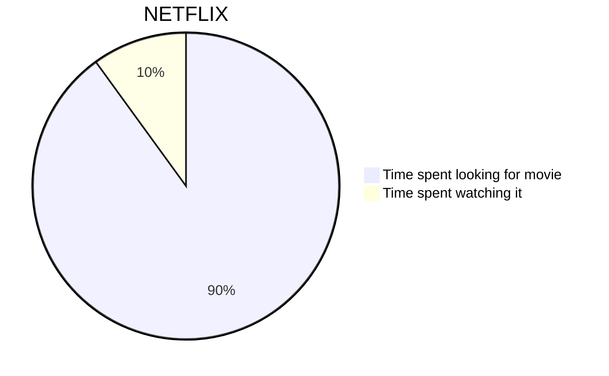

# CommonMark

## Horizontal rules

***
---
___

## Emphasis

**I'm Bold!**

__I'm Bold!__

*I'm Italic!*

_I'm Italic!_


## Blockquotes

> I am a block quote.
> > I am a block quote.

## Code blocks

    <html>
      <head>
      </head>
    </html>
    

```
git status
git add
git commit
```

## Lists

1. First item
2. Second item
3. Third item
    - Indented item
    - Indented item
4. Fourth item    

## Inline code

At the command prompt, type `nano`.

## Links

My favorite search engine is [Duck Duck Go](https://duckduckgo.com).

[README for this project](/README.md)

## Images


# GFM

## Strikethrough

~~I'm CrossedOut!~~

## Tasks

* [x] one thing to do
* [ ] another thing to do

## Tables

| Left | Center | Right |
| :--- | :----: | ----: |
| 1    |   2    |     3 |
| 4    |   5    |     6 |

## Autolinks

https://flowershow.app

# Other

## Table of contents

## YouTube Embeds

https://www.youtube.com/watch?v=y2eQoYqCyHI

## Math

Lift($L$) can be determined by Lift Coefficient ($C_L$) like the following
equation.

$$
L = \frac{1}{2} \rho v^2 S C_L
$$

## Smartypants

-- en dash

--- em dash

. . . ellipse

## Callouts

> [!note] Note
> Very important note

> [!warning] Warning!
> Very important note


## Mermaid



## Code lines numbers & highlighting

```js {1,3-4} showLineNumbers
function fancyAlert(arg) {
  if (arg) {
    $.facebox({ div: '#foo' })
  }
}
```


## Wiki Links

Simple:
[[example]]

With alias:
[[example|Example with alias]]

🚧 To heading:
[[example#abcd|Example heading]]

Nested:
[[test/test]]


